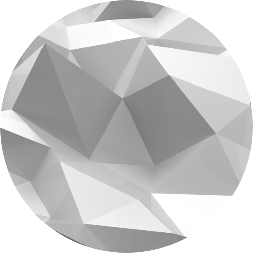

<div align="center">



# Revclip

**macOS のためのクリップボードマネージャー。Clipy の正統後継。**

[](https://www.apple.com/macos/)
[](https://developer.apple.com/documentation/objectivec)
[](https://github.com/Revclip/Revclip/releases)
[](LICENSE)
[](https://developer.apple.com/documentation/apple-silicon/)

</div>

---

## Revclip とは

Revclip は、macOS のメニューバーに常駐するクリップボードマネージャーです。多くの macOS ユーザーに愛された [Clipy](https://github.com/Clipy/Clipy) の思想を受け継ぎ、現代の macOS に最適化されたアーキテクチャでゼロから再構築しました。

Clipy が抱えていた技術的負債 -- Realm、RxSwift、CocoaPods による 15 以上の外部依存、メンテナンスが停止した Magnet/KeyHolder -- を一掃し、**依存ライブラリをわずか 2 つ**（Sparkle 2.x + FMDB）にまで削減。Apple ネイティブ API を最大限に活用することで、軽量かつ堅牢なクリップボード管理を実現しています。

```
┌─────────────────────────────────────────────────────────────────┐
│  Menu Bar                                                [RC]  │
├─────────────────────────────────────────────────────────────────┤
│                                                                 │
│   1. 会議の議事録を共有ドライブに保存してください        12:04  │
│   2. https://example.com/api/v2/users                    12:01  │
│   3. SELECT * FROM users WHERE active = 1                11:58  │
│   4. [image/png 1024x768]                                11:45  │
│   5. #FF6B35                                       ████  11:30  │
│   ─────────────────────────────────────────────────────────     │
│   > Snippets                                                    │
│   > Clear History                                               │
│   ─────────────────────────────────────────────────────────     │
│   Preferences...                                                │
│   Quit Revclip                                                  │
│                                                                 │
└─────────────────────────────────────────────────────────────────┘
```

---

## なぜ Revclip なのか

### 1. 極限まで削ぎ落とした依存関係

Clipy は CocoaPods 経由で Realm、RxSwift、RxCocoa、Magnet、KeyHolder、LoginServiceKit など 15 以上のライブラリに依存していました。Revclip はこれを **Sparkle 2.x**（自動アップデート）と **FMDB**（SQLite ラッパー）の 2 つだけに絞り込んでいます。データベースには OS 組み込みの SQLite3 を使用し、リアクティブプログラミングは NSNotificationCenter + KVO + GCD で実現。外部依存が少ないということは、ビルドの高速化、バイナリサイズの縮小、そして将来にわたるメンテナンス性の向上を意味します。

### 2. 現代の macOS に最適化

最小動作環境を macOS 14 (Sonoma) に設定し、レガシー API との互換レイヤーを排除しました。ログインアイテム管理には macOS 13 以降の `SMAppService` を採用し、macOS 16 で導入されたクリップボードプライバシー API（`NSPasteboard.accessBehavior`）にもいち早く対応。Hardened Runtime を有効にし、Apple の最新セキュリティ要件を満たしています。

### 3. Objective-C という選択

Swift ではなく Objective-C を採用しています。これは AppKit との直接的な親和性、Carbon API（グローバルホットキー用の `RegisterEventHotKey`）とのシームレスな連携、そしてランタイムの動的ディスパッチを最大限に活用するための意図的な技術選択です。

### 4. Universal Binary

arm64 (Apple Silicon) と x86_64 (Intel) の両アーキテクチャをサポートする Universal Binary としてビルドされます。Rosetta 2 を介さず、どちらの Mac でもネイティブパフォーマンスで動作します。

---

## 機能

### クリップボード管理

- **リアルタイム監視** -- `RCClipboardService` がクリップボードの変更を常時監視し、コピーされたコンテンツを自動的にキャプチャ
- **複数データ形式対応** -- テキスト (String)、リッチテキスト (RTF/RTFD)、画像 (TIFF)、PDF、ファイル URL、カラーコードなど主要な Pasteboard Type をすべてサポート
- **SHA256 ハッシュによる重複検出** -- 同一内容のコピーを検出し、重複エントリの上書きまたはスキップを設定可能
- **履歴サイズ制御** -- 保存する履歴の最大件数を設定可能（デフォルト: 30 件）
- **自動データクリーニング** -- `RCDataCleanService` が古い履歴データを自動的に削除し、ディスク使用量を適正に維持
- **ペースト後の並び替え** -- ペーストした項目を履歴の先頭に自動移動

### スニペット

- **フォルダベースの階層管理** -- スニペットをフォルダ単位で整理
- **専用エディター** -- `RCSnippetEditorWindowController` によるスニペットの作成・編集・削除
- **有効/無効の切り替え** -- スニペットおよびフォルダ単位で有効/無効をトグル可能
- **XML ベースの Import/Export** -- `RCSnippetImportExportService` によるスニペットの書き出しと読み込み、マージモード対応

### ショートカット

- **グローバルホットキー** -- Carbon API (`RegisterEventHotKey`) を直接使用した高精度なグローバルショートカット
- **4 種類のデフォルトショートカット** -- メインメニュー、履歴メニュー、スニペットメニュー、履歴クリア、それぞれに個別のキーコンビネーションを設定可能
- **フォルダ別ショートカット** -- スニペットフォルダごとに個別のホットキーを割り当て可能
- **カスタムレコーダー** -- `RCHotKeyRecorderView` による直感的なショートカット録画 UI（Magnet/KeyHolder ライブラリを完全に置き換え）
- **Carbon-Cocoa 修飾キー変換** -- Carbon 修飾キーフラグと Cocoa の `NSEventModifierFlags` を双方向に変換

### プライバシーとセキュリティ

- **アプリ除外機能** -- 1Password などの機密情報を扱うアプリケーションをクリップボード監視から除外（Bundle Identifier ベース）
- **macOS 16 クリップボードプライバシー対応** -- `NSPasteboard.accessBehavior` に対応し、OS レベルのプライバシー制御と連携
- **Accessibility 権限チェック** -- `RCAccessibilityService` がアクセシビリティ権限の状態を監視し、必要に応じてユーザーにガイダンスを表示
- **Hardened Runtime** -- Apple の Hardened Runtime を有効にしてビルド、コード署名の厳密な検証に対応

### メニュー表示

- **インラインアイテム + フォルダアイテム** -- メニュー直下に表示する件数とフォルダ内に格納する件数を個別に設定
- **サムネイル表示** -- 画像クリップのサムネイルをメニュー内にプレビュー（サイズ設定可能）
- **カラーコードプレビュー** -- カラーコード文字列の横にカラースウォッチを表示
- **数字キーショートカット** -- メニューアイテムに数字キーを割り当て、キーボードから素早くペースト
- **ツールチップ** -- メニューアイテムにマウスホバーで全文を表示（最大文字数設定可能）

### スクリーンショット連携

- **スクリーンショット監視** -- `RCScreenshotMonitorService` がスクリーンショットの撮影を検知し、自動的に履歴に取り込み（Beta 機能、オプトイン）

### システム連携

- **ログインアイテム** -- `SMAppService` (macOS 13+) による現代的なログインアイテム管理
- **自動アップデート** -- Sparkle 2.x による安全な自動アップデート（EdDSA 署名検証対応）
- **Applications フォルダへの移動促進** -- `RCMoveToApplicationsService` がダウンロードフォルダからの実行を検知し、/Applications への移動を提案

### 国際化

- 英語、日本語、ドイツ語、中国語 (簡体字)、イタリア語の 5 言語をサポート

### ペースト操作 (Beta)

- **プレーンテキスト貼り付け** -- 修飾キー + クリックでリッチテキストからプレーンテキストに変換してペースト
- **ペーストと同時に削除** -- 貼り付け後に履歴から自動削除するオプション
- **履歴の個別削除** -- 修飾キー + クリックで特定の履歴エントリを削除

---

## 技術構成

```
Revclip.app
├── AppKit + Objective-C
├── Carbon.framework ............... グローバルホットキー (RegisterEventHotKey)
├── ApplicationServices.framework .. Accessibility API
├── ServiceManagement.framework .... ログインアイテム (SMAppService)
├── SQLite3 (-lsqlite3) ........... データ永続化
├── Sparkle 2.x ................... 自動アップデート
└── FMDB .......................... SQLite ラッパー
```

| 項目 | 仕様 |
|------|------|
| 言語 | Objective-C (ARC 有効) |
| UI フレームワーク | AppKit |
| 最小動作環境 | macOS 14.0 (Sonoma) |
| ターゲット | macOS 15.0 (Sequoia) |
| アーキテクチャ | arm64 + x86_64 (Universal Binary) |
| Bundle ID | `com.revclip.Revclip` |
| ビルドシステム | xcodegen (`project.yml`) + Makefile |
| データベース | SQLite3 (`~/Library/Application Support/Revclip/revclip.db`) |
| 外部依存 | Sparkle 2.x, FMDB |
| Hardened Runtime | 有効 |
| LSUIElement | `true` (メニューバー常駐、Dock アイコン非表示) |

---

## Revclip vs Clipy

Revclip は Clipy を技術的に全面刷新したプロジェクトです。以下は両者の詳細な比較です。

| 比較項目 | Clipy | Revclip |
|---------|-------|---------|
| **言語** | Swift 5 | Objective-C |
| **外部依存** | CocoaPods 経由 15+ ライブラリ (Realm, RxSwift, RxCocoa, Magnet, KeyHolder, LoginServiceKit 他) | **2 ライブラリのみ** (Sparkle 2.x + FMDB) |
| **データベース** | Realm (独自バイナリ形式、重量級) | SQLite3 (OS 組み込み、軽量) |
| **リアクティブ基盤** | RxSwift / RxCocoa | NSNotificationCenter + KVO + GCD |
| **最小 macOS** | 10.10 (Yosemite) | 14.0 (Sonoma) |
| **自動アップデート** | Sparkle 1.x | Sparkle 2.x (EdDSA 署名) |
| **ログインアイテム** | LoginServiceKit (非推奨 `LSSharedFileList` ベース) | `SMAppService` (macOS 13+ 正規 API) |
| **ホットキー** | Magnet + KeyHolder (外部ライブラリ) | Carbon API 直接呼び出し (自前実装) |
| **macOS 16 プライバシー** | 非対応 | 対応 (`NSPasteboard.accessBehavior`) |
| **スニペット Import/Export** | 非対応 | XML 形式でサポート (マージ対応) |
| **スニペット有効/無効** | 非対応 | フォルダ/スニペット単位で切り替え可能 |
| **スクリーンショット監視** | 非対応 | 対応 (Beta) |
| **Hardened Runtime** | 無効 | 有効 |
| **バイナリサイズ** | 大 (Realm + Rx + 多数の Pods) | 小 (ネイティブ API 主体) |
| **アーキテクチャ** | x86_64 中心 | Universal Binary (arm64 + x86_64) |
| **メンテナンス状況** | 事実上停止 | アクティブ開発中 |

### なぜ Clipy から移行すべきか

**1. 依存ライブラリの問題**

Clipy は Realm をデータベースに採用していますが、Realm は巨大なバイナリフレームワークであり、macOS のメジャーアップデートのたびに互換性の問題が発生するリスクがあります。Revclip は macOS に標準搭載されている SQLite3 を使用するため、OS アップデートによる影響を受けません。

**2. レガシー API からの脱却**

Clipy の `LoginServiceKit` は Apple が非推奨とした `LSSharedFileList` API に依存しており、将来の macOS で動作しなくなる可能性があります。Revclip は `SMAppService` を使用し、Apple の推奨する現代的なアプローチを採用しています。

**3. セキュリティの強化**

Hardened Runtime が有効でない Clipy は、macOS の Gatekeeper やNotarization の要件を満たすことが困難です。Revclip は Hardened Runtime を有効にしてビルドされ、コード署名と公証 (Notarization) に完全対応しています。

**4. Apple Silicon ネイティブ**

Revclip は Universal Binary としてビルドされるため、Apple Silicon Mac で Rosetta 2 を介さずネイティブに動作します。

---

<div align="center">

Copyright 2024-2026 Revclip. All rights reserved.

**REV-C Inc.**

</div>
