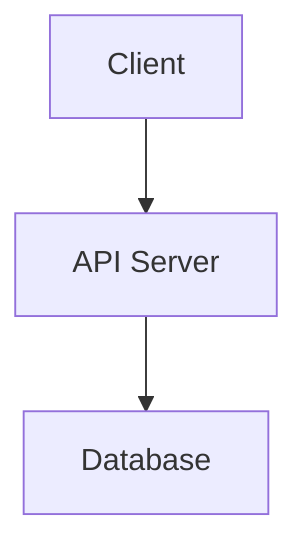

# Documentation

このディレクトリには、プロジェクトのドキュメントを格納します。
**エージェントによる品質のバラつきを防ぐため、以下のルールとテンプレートを厳守してください。**

## 1. ディレクトリ構成

```
docs/
├── requirements/      # 要件定義書、ユーザーストーリー
├── design/            # アーキテクチャ設計、DBスキーマ、API仕様
├── manual/            # 運用マニュアル、セットアップガイド
├── roles/             # 役割定義（Coder/Reviewer/Orchestrator）
├── prompts/           # レビュワープロンプトテンプレート
├── release-notes/     # リリースノート
├── incidents/         # インシデント記録
└── entitlements/      # 署名・公証用設定
```

## 2. 共通ルール
- **フォーマット:** Markdown (.md)
- **図解:** フローチャートやシーケンス図が必要な場合は、必ず **Mermaid記法** を使用すること。
- **更新:** コードの変更に合わせてドキュメントも即座に更新すること（陳腐化の防止）。

## 3. テンプレート: 要件定義書 (`requirements/xxxx.md`)

```markdown
# [Title] 要件定義書

## 1. 概要 (Overview)
- **目的:** 何のために作るのか（ビジネスゴール）。
- **スコープ:** 何を含み、何を含まないか。

## 2. ユーザーストーリー (User Stories)
- ユーザーは [目的] のために、[機能] を利用できる。
- 管理者は [目的] のために、[機能] を利用できる。

## 3. 機能要件 (Functional Requirements)
- [ ] **FR-01:** ログイン機能（Google Auth）
- [ ] **FR-02:** CSVエクスポート

## 4. 非機能要件 (Non-Functional Requirements)
- **パフォーマンス:** ページロード 1秒以内
- **セキュリティ:** データは暗号化保存
```

## 4. テンプレート: 技術設計書 (`design/xxxx.md`)

```markdown
# [Title] 技術設計書

## 1. アーキテクチャ (Architecture)


## 2. データモデル (Data Model)
- **User:** `id`, `email`, `created_at`
- **Post:** `id`, `user_id`, `content`

## 3. API インターフェース (API Interface)
- `GET /users`: ユーザー一覧取得
- `POST /posts`: 投稿作成
```

## 5. アーカイブ基準
- 仕様変更により**無効になったドキュメント**は、`.agent/archive/docs/` へ移動させてください。
