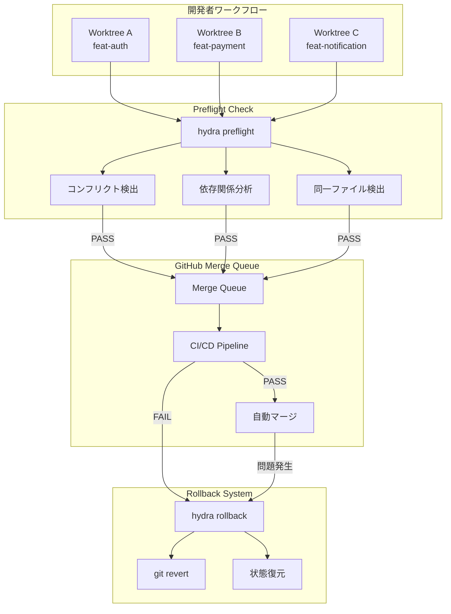
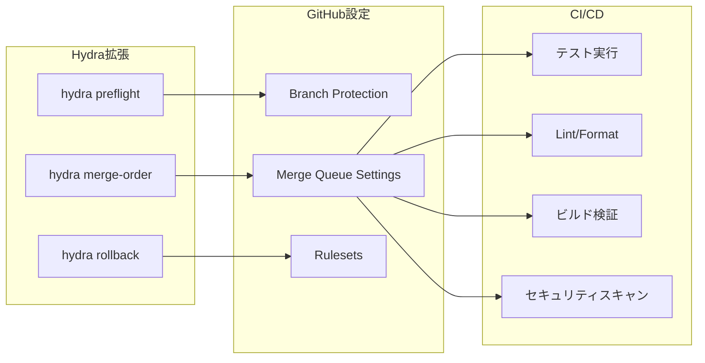
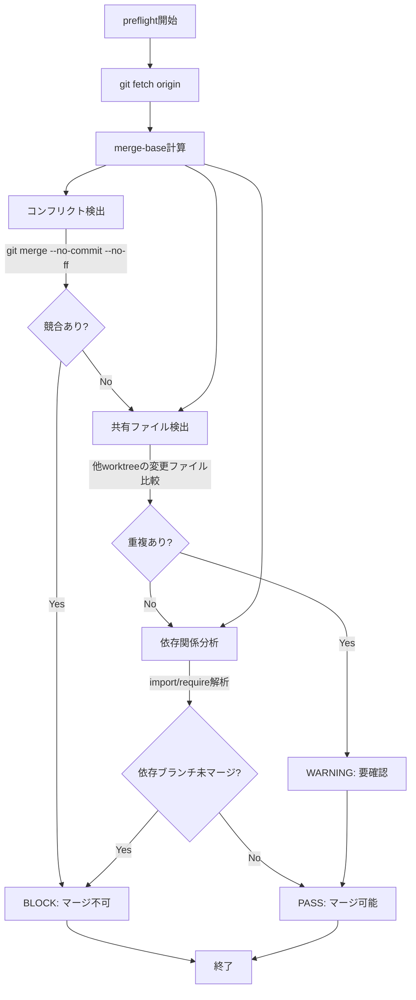
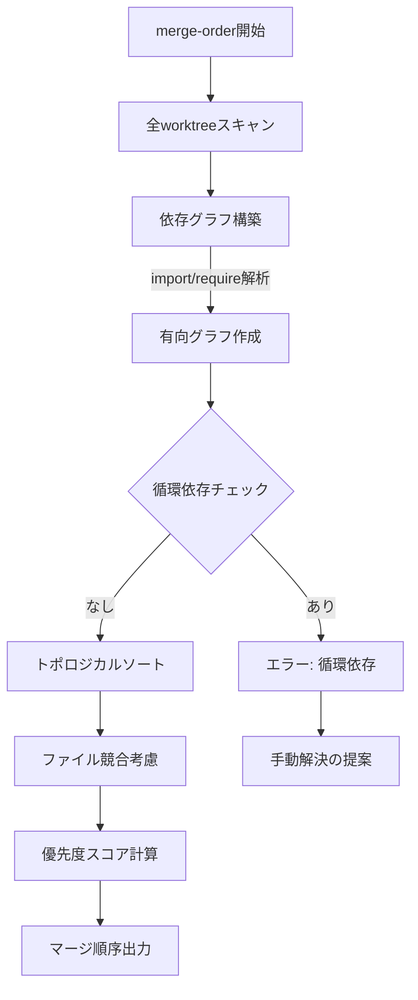
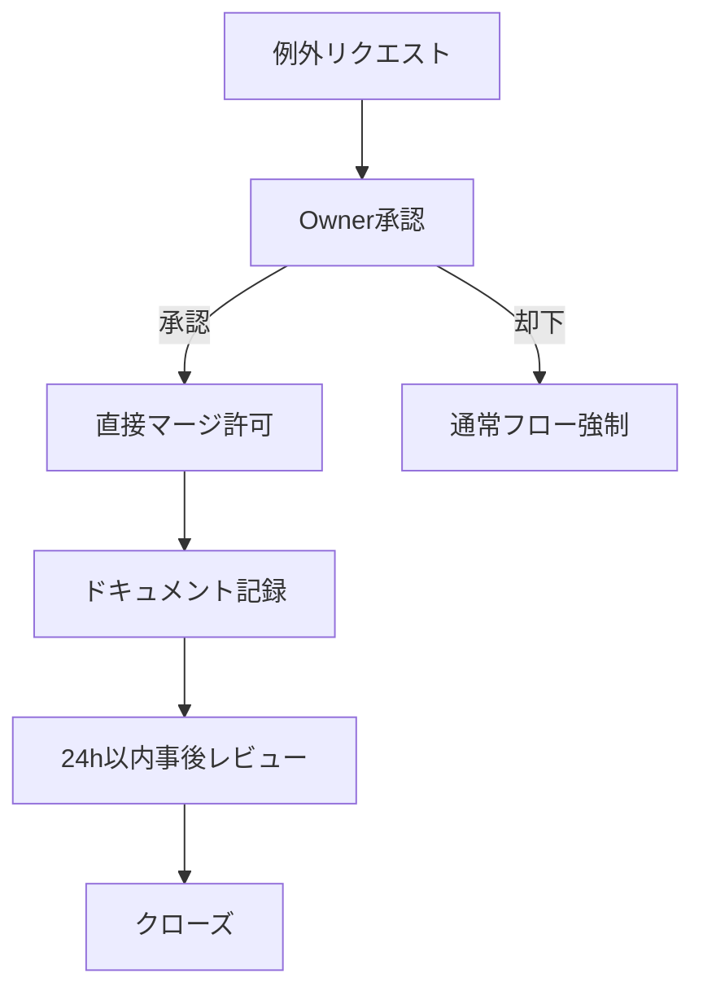
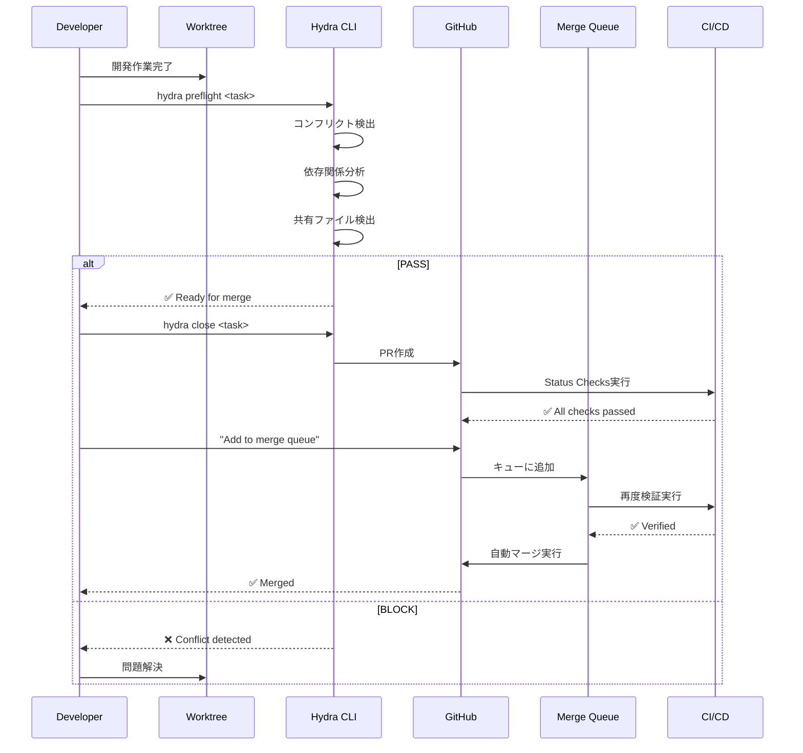
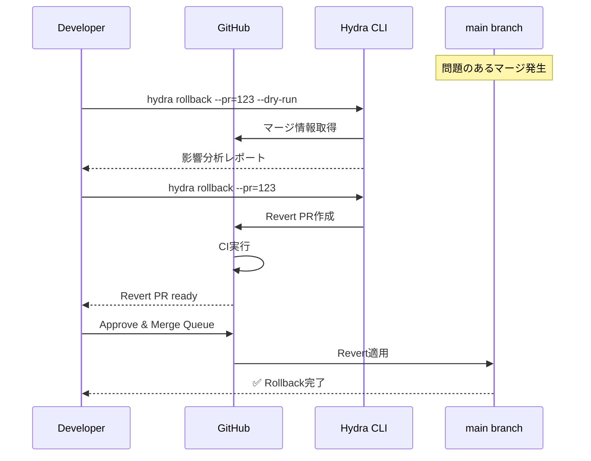
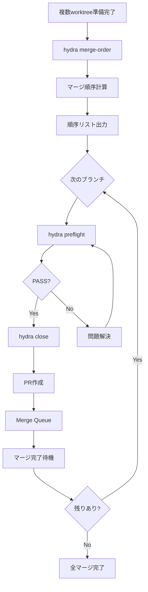

# Safe Merge Protocol 設計書

## 1. 概要

本ドキュメントは、複数のGit Worktreeで並行開発を行う環境において、`main`ブランチへの安全なマージを実現するためのプロトコルを定義する。

### 1.1 背景

Hydraによるworktree並行開発では、複数の機能ブランチが同時進行する。この状況下で以下の問題が発生しうる：

- 共通ファイル（`package.json`、lockfile、設定ファイル等）の競合
- 依存関係の不整合（機能Aが機能Bの変更に依存する場合の逆順マージ）
- マージ後のCI失敗によるmain破壊
- ロールバック手段の欠如

### 1.2 目的

1. **予防的検出**: マージ前にコンフリクトと依存関係の問題を検出
2. **安全なマージ**: Merge Queue経由での自動検証とマージ
3. **迅速な復旧**: 問題発生時のロールバック手段の確保

---

## 2. 現状の問題点

### 2.1 Hydraの制約

| 機能 | 現状 | 問題点 |
|------|------|--------|
| `hydra close` | PR作成まで | マージ自体は行わない |
| コンフリクト検出 | なし | マージ時まで発見できない |
| 同一ファイル編集検出 | なし | 複数worktree間の競合を検知不可 |
| ロールバック | なし | 問題発生時の復旧手段なし |
| マージ順序決定 | なし | 依存関係を考慮したマージ順序なし |

### 2.2 高リスクシナリオ

```
┌─────────────────────────────────────────────────────────────┐
│                    高リスクシナリオ                          │
├─────────────────────────────────────────────────────────────┤
│ 1. 共通ファイル競合                                          │
│    - package.json の依存追加が複数ブランチで発生              │
│    - lockfile の非決定的マージ                               │
│    - 設定ファイル（tsconfig.json, .env.example等）の競合      │
│                                                             │
│ 2. 認証基盤の同時編集                                        │
│    - 認証ミドルウェアの変更が複数機能で発生                    │
│    - セッション管理の破壊的変更                               │
│                                                             │
│ 3. 依存鎖の逆順マージ                                        │
│    - 機能BがAPIスキーマ変更を含む機能Aに依存                   │
│    - 機能Bを先にマージすると型エラー/ランタイムエラー          │
│                                                             │
│ 4. API契約・スキーマの不整合                                  │
│    - OpenAPI/GraphQLスキーマの同時変更                        │
│    - DBマイグレーションの競合                                 │
└─────────────────────────────────────────────────────────────┘
```

---

## 3. アーキテクチャ設計

### 3.1 全体構成



### 3.2 コンポーネント構成



---

## 4. 実装フェーズ

### 4.1 Phase 0 (P0): GitHub Merge Queue設定 【優先度: 最高】

**工数見積: 0.5-1日**

#### 目的
GitHub Merge Queueを有効化し、mainブランチへの直接マージを防止する。

#### 実装内容

1. **Branch Protection Rules の設定**
   ```yaml
   # .github/settings.yml または GitHub UI
   branches:
     - name: main
       protection:
         required_pull_request_reviews:
           required_approving_review_count: 1
           dismiss_stale_reviews: true
         required_status_checks:
           strict: true
           contexts:
             - "CI / test"
             - "CI / lint"
             - "CI / build"
         enforce_admins: true
         require_merge_queue: true
   ```

2. **Merge Queue Settings**
   ```yaml
   merge_queue:
     merge_method: squash
     build_concurrency: 2
     min_entries_to_merge: 1
     max_entries_to_build: 3
     entry_requirements:
       - status_check: "CI / test"
       - status_check: "CI / lint"
   ```

3. **Rulesets（推奨）**
   - Repository Rulesets を使用してより細かい制御
   - `main`、`develop`、`release/*` に適用

#### 検証項目
- [ ] 直接プッシュがブロックされること
- [ ] PR経由でのみマージ可能なこと
- [ ] Merge Queueが正しく動作すること
- [ ] CI失敗時にマージがブロックされること

---

### 4.2 Phase 1 (P1): 運用ルール追加 【優先度: 高】

**工数見積: 0.5-1日**

#### 目的
RULES.mdにSafe Merge Protocolのルールを追加し、エージェント・開発者全員が遵守すべき行動規範を定義する。

#### 追加内容
- Section 15: Safe Merge Protocol を RULES.md に追加
- マージ前チェックリストの標準化
- 例外フローの明文化

---

### 4.3 Phase 1 (P1): hydra preflight 【優先度: 高】

**工数見積: 2-4日**

#### 目的
マージ前にコンフリクトと依存関係の問題を事前検出する。

#### コマンド仕様

```bash
# 基本使用法
hydra preflight <task-name>

# オプション
hydra preflight <task-name> --base=main     # ベースブランチ指定
hydra preflight <task-name> --all           # 全worktree対象
hydra preflight <task-name> --fix           # 自動修正可能な問題を解決
```

#### 出力形式

```
$ hydra preflight feat-auth

🔍 Preflight Check: feat-auth → main

━━━━━━━━━━━━━━━━━━━━━━━━━━━━━━━━━━━━━━━━━━━━━━━━
📁 File Conflict Analysis
━━━━━━━━━━━━━━━━━━━━━━━━━━━━━━━━━━━━━━━━━━━━━━━━

✅ No direct conflicts with main

⚠️  Shared file warnings:
   - package.json: also modified in feat-payment
   - src/lib/auth.ts: also modified in feat-notification

━━━━━━━━━━━━━━━━━━━━━━━━━━━━━━━━━━━━━━━━━━━━━━━━
🔗 Dependency Analysis
━━━━━━━━━━━━━━━━━━━━━━━━━━━━━━━━━━━━━━━━━━━━━━━━

✅ No blocking dependencies detected

ℹ️  Recommended merge order:
   1. feat-payment (no dependencies)
   2. feat-auth (no dependencies)
   3. feat-notification (depends on: feat-auth)

━━━━━━━━━━━━━━━━━━━━━━━━━━━━━━━━━━━━━━━━━━━━━━━━
📊 Summary
━━━━━━━━━━━━━━━━━━━━━━━━━━━━━━━━━━━━━━━━━━━━━━━━

Status: ✅ PASS (with warnings)
Ready for: hydra close feat-auth
```

#### 検出ロジック



#### 実装詳細

```bash
# scripts/hydra に追加する関数

preflight() {
    local task_name="$1"
    local base_branch="${2:-main}"
    local worktree_path="$WORKSPACE_DIR/$task_name"

    # 1. ベースブランチの最新取得
    git fetch origin "$base_branch"

    # 2. マージベース計算
    local merge_base=$(git merge-base HEAD "origin/$base_branch")

    # 3. コンフリクト検出（dry-run）
    if ! git merge --no-commit --no-ff "origin/$base_branch" 2>/dev/null; then
        echo "❌ BLOCK: Direct conflict detected"
        git merge --abort
        return 1
    fi
    git merge --abort 2>/dev/null

    # 4. 他worktreeとの共有ファイル検出
    local changed_files=$(git diff --name-only "$merge_base"..HEAD)
    check_shared_files "$changed_files"

    # 5. 依存関係分析
    analyze_dependencies "$task_name"

    # 6. 結果サマリ
    generate_preflight_report
}
```

---

### 4.4 Phase 2 (P2): hydra merge-order 【優先度: 中】

**工数見積: 4-7日**

#### 目的
複数worktreeの最適なマージ順序を自動計算する。

#### コマンド仕様

```bash
# 全worktreeのマージ順序を計算
hydra merge-order

# 特定ブランチを含む順序のみ
hydra merge-order --include=feat-auth,feat-payment

# JSON出力
hydra merge-order --format=json
```

#### 出力形式

```
$ hydra merge-order

🔢 Recommended Merge Order
━━━━━━━━━━━━━━━━━━━━━━━━━━━━━━━━━━━━━━━━━━━━━━━━

Priority  Branch              Dependencies         Status
────────────────────────────────────────────────────────────
   1      feat-payment        (none)               ✅ Ready
   2      feat-auth           (none)               ✅ Ready
   3      feat-notification   feat-auth            ⏳ Waiting

━━━━━━━━━━━━━━━━━━━━━━━━━━━━━━━━━━━━━━━━━━━━━━━━

💡 Suggested actions:
   1. hydra preflight feat-payment && hydra close feat-payment
   2. hydra preflight feat-auth && hydra close feat-auth
   3. (after feat-auth merged) hydra preflight feat-notification
```

#### 順序決定アルゴリズム



#### 優先度スコア計算

```
Score = (依存されている数 × 10) + (変更ファイル数 × -1) + (競合リスク × -5)

- 依存されているブランチほど優先度高
- 変更ファイルが少ないほど優先度高
- 競合リスクが低いほど優先度高
```

---

### 4.5 Phase 2 (P2): hydra rollback 【優先度: 中】

**工数見積: 2-3日**

#### 目的
問題発生時に迅速にロールバックを実行する。

#### コマンド仕様

```bash
# 直近のマージをロールバック
hydra rollback --last

# 特定コミットまでロールバック
hydra rollback --to=<commit-hash>

# 特定PRのマージをrevert
hydra rollback --pr=123

# dry-run（実行せずに確認）
hydra rollback --last --dry-run
```

#### 出力形式

```
$ hydra rollback --pr=123 --dry-run

🔄 Rollback Preview: PR #123
━━━━━━━━━━━━━━━━━━━━━━━━━━━━━━━━━━━━━━━━━━━━━━━━

Target: feat-auth merged at 2024-01-15 10:30:00
Commit: abc1234 "feat: add OAuth2 authentication"

Changes to revert:
  - src/lib/auth.ts (+150/-20)
  - src/middleware/session.ts (+45/-10)
  - package.json (+3/-0)

⚠️  Impact analysis:
  - No dependent features detected
  - Safe to revert

━━━━━━━━━━━━━━━━━━━━━━━━━━━━━━━━━━━━━━━━━━━━━━━━

To execute: hydra rollback --pr=123
```

---

## 5. GitHub設定ガイド

### 5.1 Repository Settings

```yaml
# Settings > General
Default branch: main

# Settings > Branches > Branch protection rules
Branch name pattern: main

☑️ Require a pull request before merging
  ☑️ Require approvals: 1
  ☑️ Dismiss stale pull request approvals when new commits are pushed

☑️ Require status checks to pass before merging
  ☑️ Require branches to be up to date before merging
  Required checks:
    - CI / test
    - CI / lint
    - CI / build

☑️ Require merge queue
  Merge method: Squash and merge
  Build concurrency: 2
  Minimum entries to merge: 1
  Maximum entries to build: 3

☑️ Do not allow bypassing the above settings
```

### 5.2 Merge Queue Configuration

```yaml
# .github/merge-queue.yml (GitHub Apps対応の場合)
version: 1
merge_queue:
  merge_method: squash
  build_concurrency: 2
  entry_requirements:
    required_checks:
      - name: "CI / test"
        timeout_minutes: 30
      - name: "CI / lint"
        timeout_minutes: 10
      - name: "CI / build"
        timeout_minutes: 15
```

### 5.3 Rulesets（推奨）

```yaml
# Repository > Settings > Rules > Rulesets
name: "Protected Branches"
enforcement: active
target: branch
conditions:
  ref_name:
    include:
      - "~DEFAULT_BRANCH"
      - "refs/heads/develop"
      - "refs/heads/release/*"
rules:
  - type: pull_request
    parameters:
      required_approving_review_count: 1
      dismiss_stale_reviews_on_push: true
  - type: required_status_checks
    parameters:
      required_status_checks:
        - context: "CI / test"
        - context: "CI / lint"
        - context: "CI / build"
      strict_required_status_checks_policy: true
  - type: merge_queue
    parameters:
      merge_method: squash
```

---

## 6. 運用ルール

### 6.1 基本原則

1. **Merge Queue経由必須**: main/developへのマージはMerge Queue経由のみ
2. **直接プッシュ禁止**: main/developへの直接プッシュは禁止
3. **Preflight必須**: `hydra close`の前に`hydra preflight`の実行が必須
4. **同一ファイル競合はBLOCK**: 自動マージ不可、手動解決必須

### 6.2 例外フロー



#### 例外申請テンプレート

```markdown
## 例外申請: Direct Merge Request

**申請者:** @username
**対象PR:** #123
**理由:**
- [ ] 緊急hotfix（本番障害対応）
- [ ] Merge Queueの技術的障害
- [ ] その他（詳細記載）

**影響範囲:**
- 変更ファイル: ...
- 影響するサービス: ...

**事後レビュー担当:** @reviewer
**事後レビュー期限:** YYYY-MM-DD HH:MM

---
Owner承認: @owner
```

---

## 7. マージ前チェックリスト

### 7.1 開発者チェックリスト

```markdown
## Pre-Merge Checklist

### 必須項目
- [ ] `hydra preflight <task>` を実行し、PASSを確認
- [ ] ローカルでテストが全てパス
- [ ] コードレビュー承認済み
- [ ] コンフリクトなし

### 推奨項目
- [ ] `hydra merge-order` で順序を確認（複数PR同時の場合）
- [ ] 変更内容に応じたマニュアルテスト実施
- [ ] パフォーマンス影響の考慮

### 高リスク変更時の追加項目
- [ ] 認証/認可関連: セキュリティレビュー完了
- [ ] DB変更: マイグレーションのロールバック手順確認
- [ ] API変更: 後方互換性の確認
```

### 7.2 自動チェック項目

| チェック項目 | 実行タイミング | 失敗時の動作 |
|-------------|--------------|-------------|
| Unit Tests | PR作成・更新時 | マージブロック |
| Lint/Format | PR作成・更新時 | マージブロック |
| Build | PR作成・更新時 | マージブロック |
| Type Check | PR作成・更新時 | マージブロック |
| Security Scan | PR作成・更新時 | 警告（重大度Highでブロック） |
| Conflict Check | Merge Queue投入時 | キューから除外 |

---

## 8. フロー図

### 8.1 通常マージフロー



### 8.2 ロールバックフロー



### 8.3 複数worktreeマージフロー



---

## 9. 付録

### 9.1 用語集

| 用語 | 説明 |
|------|------|
| Merge Queue | GitHubの機能。PRを順番に検証・マージするキュー |
| Preflight | マージ前の事前検証 |
| Worktree | Gitの機能。同一リポジトリで複数の作業ディレクトリを持つ |
| Hydra | 本プロジェクトのworktree管理CLI |

### 9.2 関連ドキュメント

- [RULES.md - Section 15: Safe Merge Protocol](../../.agent_rules/RULES.md)
- [GitHub Merge Queue Documentation](https://docs.github.com/en/repositories/configuring-branches-and-merges-in-your-repository/configuring-pull-request-merges/managing-a-merge-queue)
- [Git Worktree Documentation](https://git-scm.com/docs/git-worktree)

### 9.3 変更履歴

| 日付 | バージョン | 変更内容 |
|------|-----------|---------|
| 2026-01-05 | 1.0 | 初版作成 |
